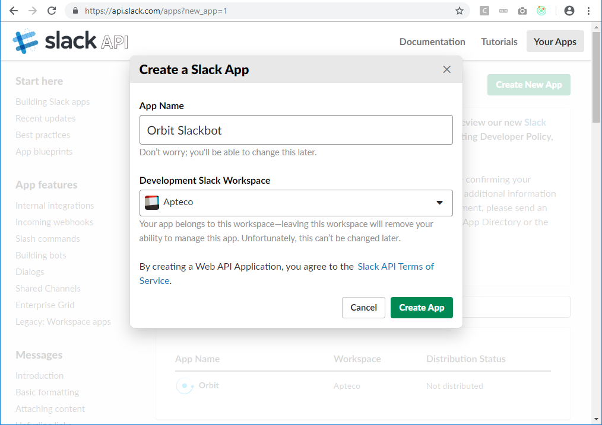
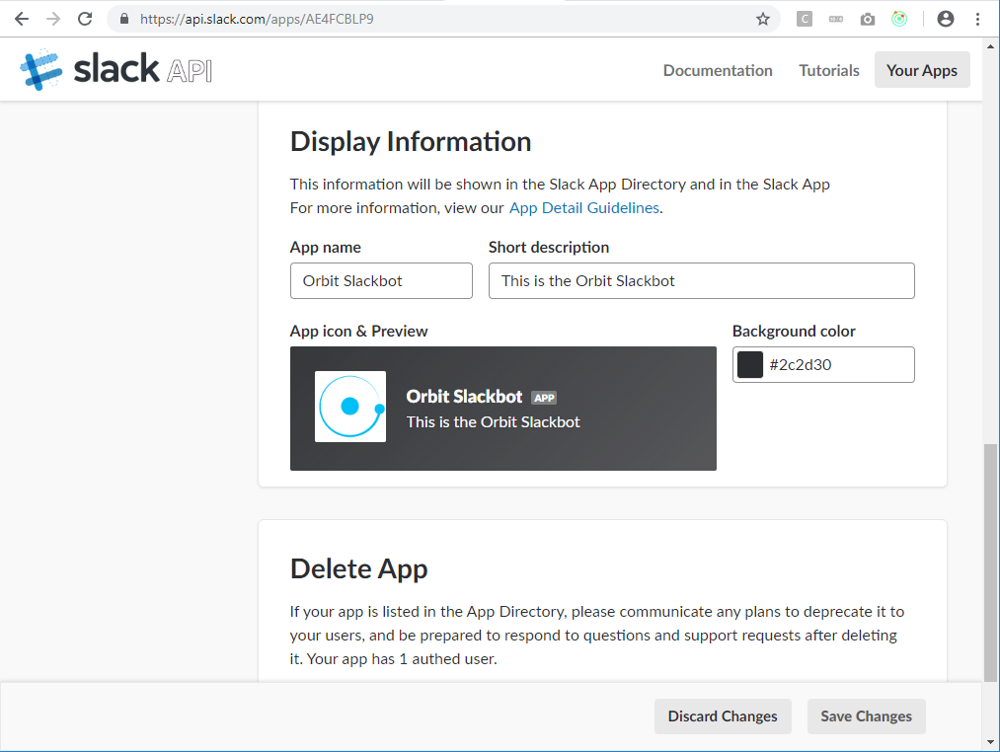
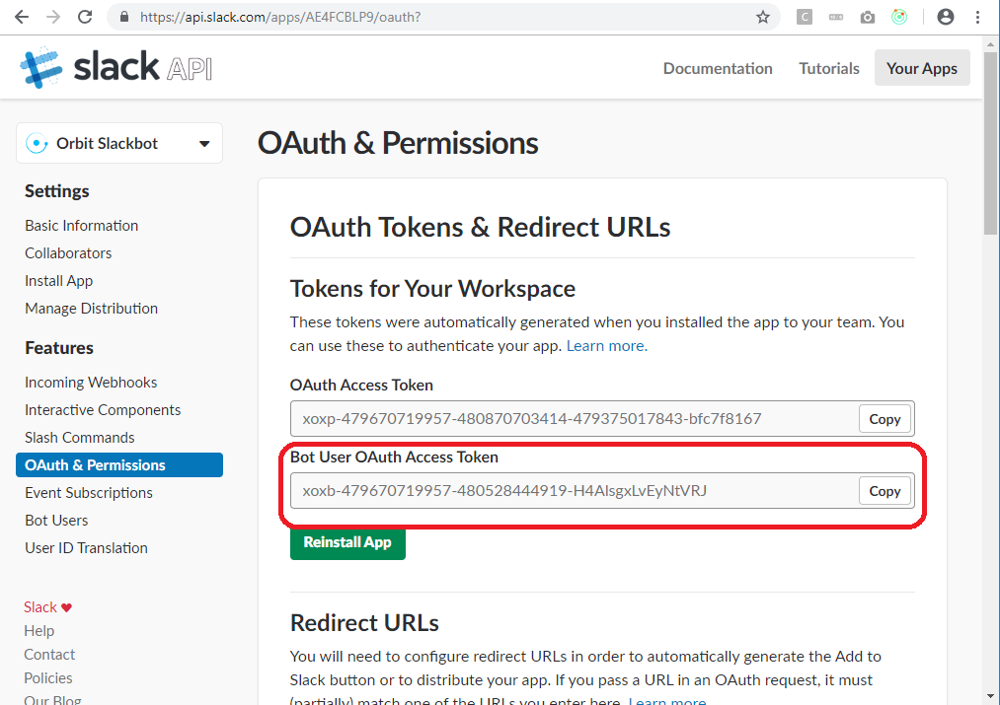
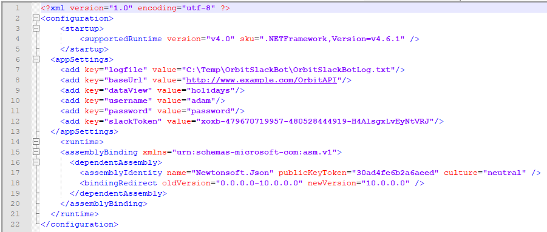
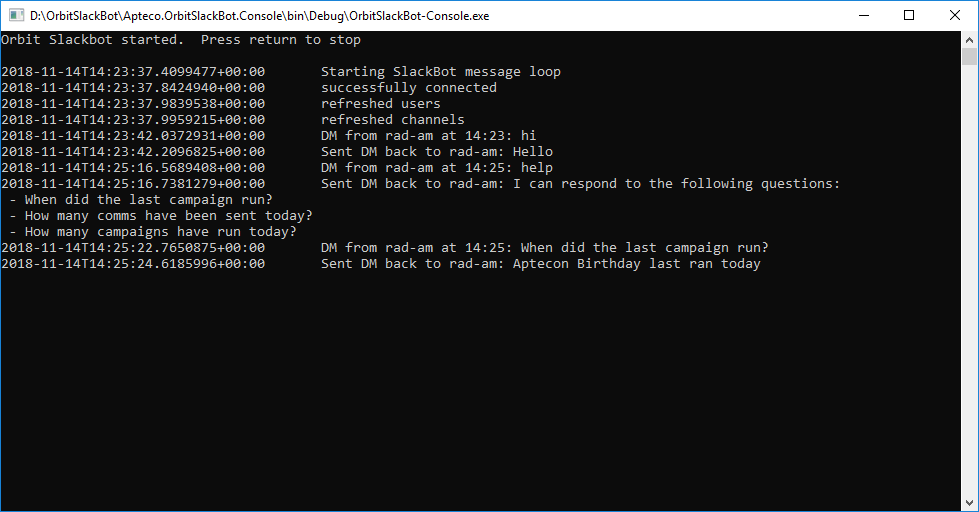
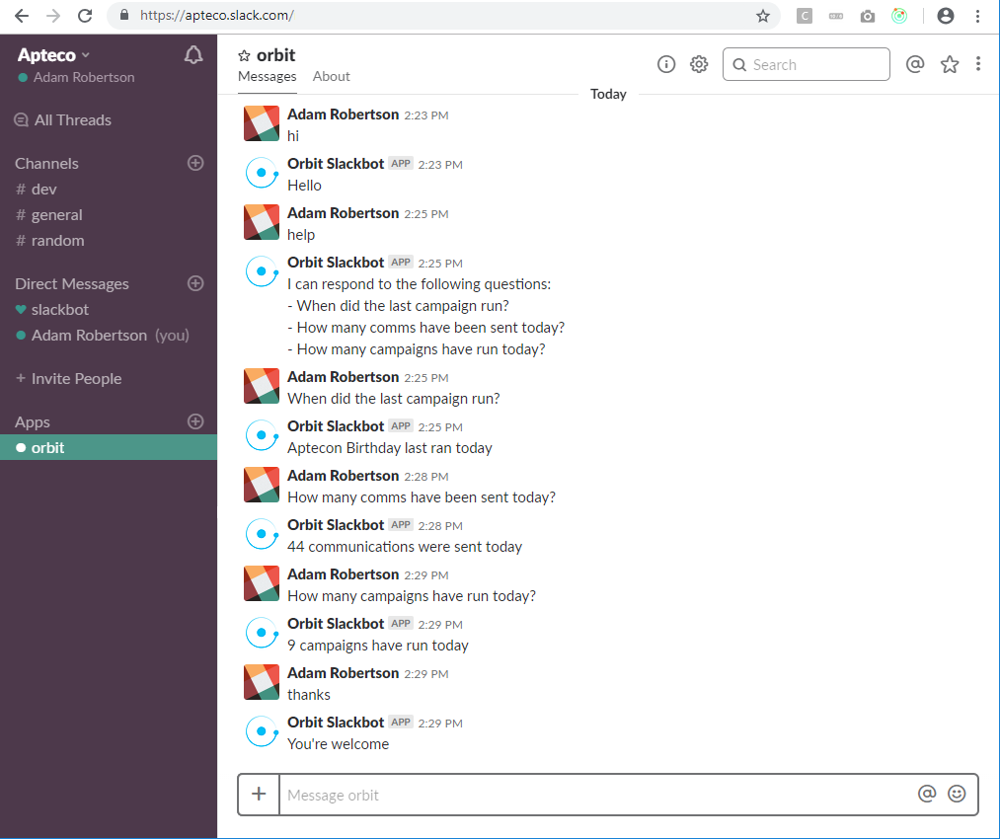

# OrbitSlackBot
A Slackbot that connects to an install of the Apteco API to pull back Orbit share information

### Getting started
You will need to register your Slackbot with Slack and then either install and configure it or
run it from Visual Studio.

You will then be able to chat with it via Slack.

1. [How to register your Slackbot](#how-to-register-your-slackbot)
2. [How to install your Slackbot from the MSI](#how-to-install-your-slackbot-from-the-msi)
3. [How to run your Slackbot from Visual Studio](#how-to-run-your-slackbot-from-visual-studio)
4. [Chatting with your Slackbot](#chatting-with-your-slackbot)
5. [How the code is organised](#how-the-code-is-organised)

### How to register your Slackbot
You will need to register your Slackbot with your Slack account to enable you to talk to it. This
will create an app for use as an "Internal Integration", which is only usable from the specified
Slack workspace and is not visible to the rest of the world.  Because the Slackbot will be configured
to connect to your Apteco API then this is what you want.

The instructions on how to do this are available at https://api.slack.com/slack-apps, but the steps
that apply to the Orbit Slackbot are:

* Go to https://api.slack.com/apps?new_app=1 to register a new app in your workspace.
* Enter a name for your app and the Slack workspace it will be part of.  Hit the Create App button.

* You should now see the settings for your app (if not, just select your app to open the settings page). 
In the Basic Information section press the "Bots" button under "Features and functionality" to create a
Slack user for the Slackbot.  Go with the defaults and press the "Add a Bot User".

* In the menu on the left hand side, go back to the "Basic Information" section and then scroll down to
Display Information.  Ensure you're happy with the name and description for your bot and then add an
app icon. You can use the Orbit icon if you want by browsing to
OrbitSlackBot\Apteco.OrbitSlackBot.Resources\Images\logo-orbit-01-blue-icon-bigger.png.

* Enter a background colour (the default of "#2C2D30# is fine - or choose another)

* Hit the Save Changes button at the bottom of the screen.

* Then go back to the top of the "Basic Information" section again and inside the "Install your app
to your workspace" part, press the "Install App to Workspace" button.  This will bring up a
confirmation screen - press "Authorise".

* Then go to the "OAuth & Permissions" section of the page.  There should be "Bot User OAuth Access
Token" populated.  Copy this to your clipboard as the Slackbot will need this to communicate with Slack.

### How to install your Slackbot from the MSI
You can get the latest release installer from the github releases section.

The MSI installer will by default install the Slackbot as a Windows Service.  The installation also
includes a command line version.  Run the installer and then edit the file "OrbitSlackBot.exe.config"
in the install directory (by default C:\Program Files (x86)\Apteco\Orbit Slack Bot).  The file needs
to contain the following details:

* The location of a log file to write any logging information to.
* The URL of the Apteco API to connect to
* The name of the Orbit DataView to fetch information from
* A username and password to connect to the Apteco API with
* The Slack OAuth token to use to connect to the associated Slack workspace.  This is the token you
got from the last step when you registered your Slackbot (see above).  Note the image below contains
a fake token - you will need to generate your own!

Save the settings and restart the Slackbot Service to have them take effect.

### How to run your Slackbot from Visual Studio
Open the OrbitSlackBot.sln file and build the Slackbot.  Then set the Console project as the startup
project and in the Console project's Debug setting add the following command line parameters:

1. Apteco API URL
2. Orbit DataView name
3. username
4. password
5. Slack OAuth token

Then run the project and the Slackbot should start up.

### Chatting with your Slackbot
Once your service has started correctly, or you are running from within Visual Studio the Slackbot
should show as online and you should be able to hold a conversation with it.

You can say "Hi" and then ask "help" to see what capabilities it has.  Don't forget to say thanks
when you have finished chatting.

### How the code is organised
The structure of the OrbitSlackBot code is as follows:

* `Apteco.OrbitSlackBot.ApiClient`: Code generated with 
[Swagger Codegen](https://swagger.io/tools/swagger-codegen/) from the Apteco API that allows you to call the API.
* `Apteco.OrbitSlackBot.Console`: A Windows console application that runs the Slackbot.
* `Apteco.OrbitSlackBot.Core`: The core of the bot that both sends and receives Slack messages and
that also uses the `ApiClient` package to communicate with the Apteco API.
* `Apteco.OrbitSlackBot.Resources`: A project that just holds resources such as images for the Slackbot
* `Apteco.OrbitSlackBot.Service`: A Windows service application that runs the Slackbot
* `OrbitSlackBotServiceSetup`: The installer project that builds the MSI.

The [SlackAPI](https://github.com/Inumedia/SlackAPI) package is used to communicate with Slack.